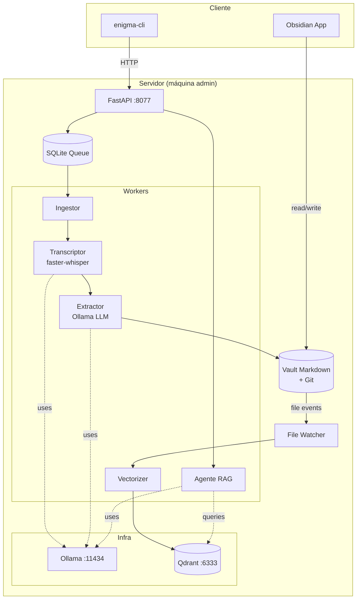
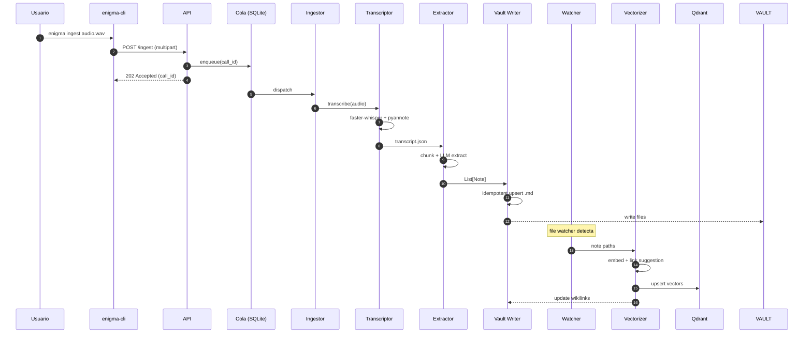
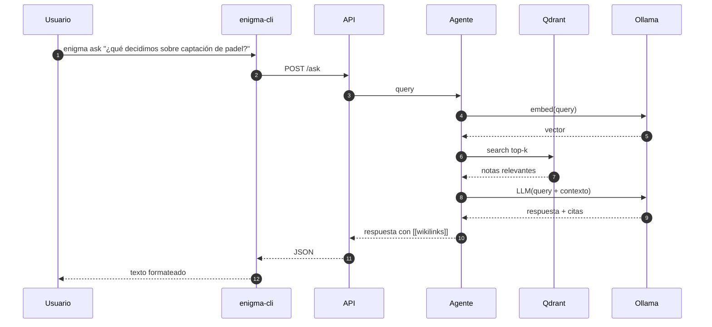
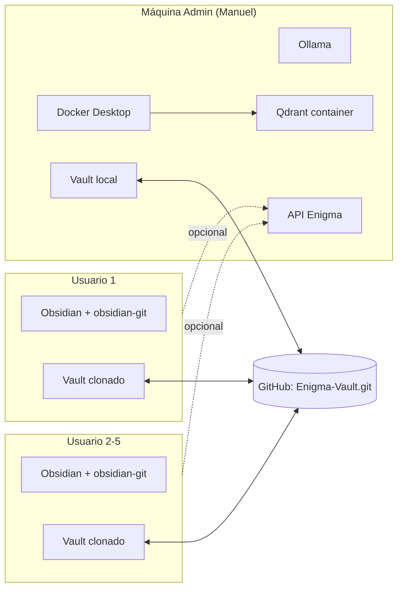

# Enigma — Arquitectura

> Vista detallada de componentes, flujos y decisiones de despliegue.

---

## 1. Diagrama de componentes (alto nivel)



---

## 2. Flujo principal: de audio a nota conectada



---

## 3. Flujo de consulta (RAG)



---

## 4. Topología de despliegue



**Notas:**
- El procesamiento pesado (transcripción + LLM) corre **solo en la máquina admin**. Los demás usuarios consumen las notas vía Obsidian.
- Si un usuario quiere ingerir un audio, lo envía al admin (drag-and-drop en una carpeta compartida, o vía CLI apuntando a la API).
- El Vault se sincroniza vía **Git** (no Syncthing).

---

## 5. Layout del Vault de Obsidian

```
vault/
├── .obsidian/                  # config compartida (themes, plugins)
├── .gitignore                  # ignora workspace.json local
├── inbox/                      # notas recién extraídas, sin validar
│   └── 2026-05-14-estrategia-captacion-padel-8f2a1c.md
├── notes/                      # notas validadas (movidas desde inbox)
│   └── estrategia-captacion-padel-8f2a1c.md
├── calls/                      # nota índice por llamada
│   └── 2026-05-14-brainstorm-captacion.md
├── people/                     # notas-entidad por persona (v2)
│   └── manuel.md
├── topics/                     # hubs temáticos (v2)
│   └── padel.md
├── decisions/                  # decisiones extraídas (v2)
│   └── 2026-05-14-precio-equipacion-padel.md
└── tasks/                      # tareas extraídas (v2)
    └── tasks.md
```

**Convenciones:**
- Una nota cambia de carpeta solo cuando un humano la valida (mueve de `inbox/` a `notes/`).
- El status del frontmatter se actualiza al mover: `draft → validated`.
- `archived/` es opcional para notas obsoletas que no queremos borrar.

---

## 6. Plugins recomendados de Obsidian

Los plugins se versionan en `vault/.obsidian/community-plugins.json`:

- `obsidian-git` — sync automático con GitHub
- `dataview` — queries sobre el frontmatter (decisiones, tareas, etc.)
- `templater` — plantillas para notas creadas a mano
- `graph-analysis` — métricas del grafo (centralidad, comunidades)
- `excalidraw` — diagramas embebidos (ya tienes el conector Excalidraw)

---

## 7. Modelo de seguridad

- **Repositorio del Vault privado** en GitHub (no público).
- Acceso por SSH key por usuario.
- Audios nunca se commitean al Vault (solo notas derivadas).
- Audios en disco local del admin, en carpeta `data/audio/` excluida por `.gitignore`.
- Variables sensibles en `.env`, fuera del repo.
- En v2: cifrado at-rest de audios con `cryptography`/`age`.
